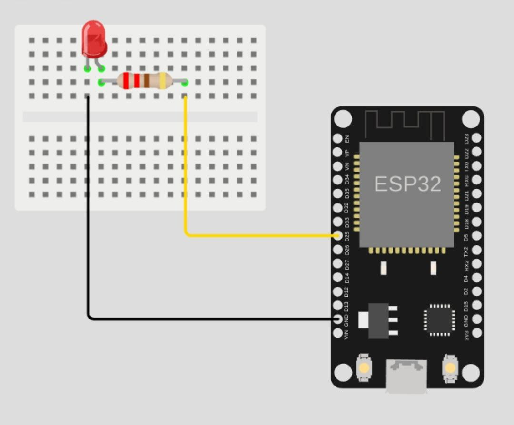
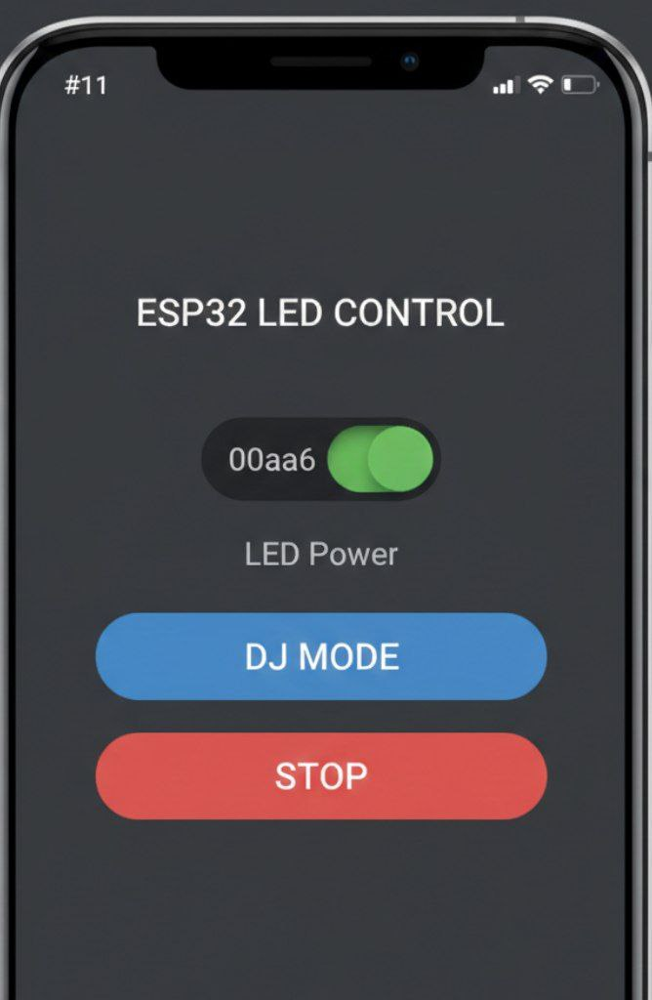
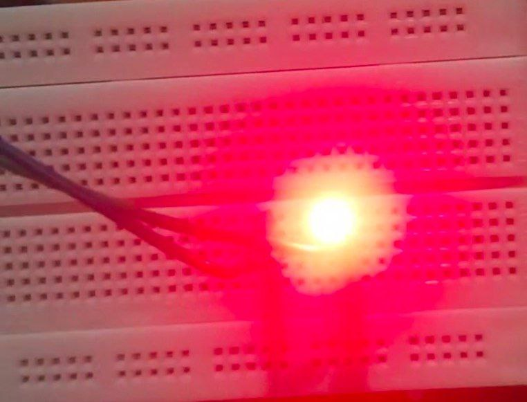
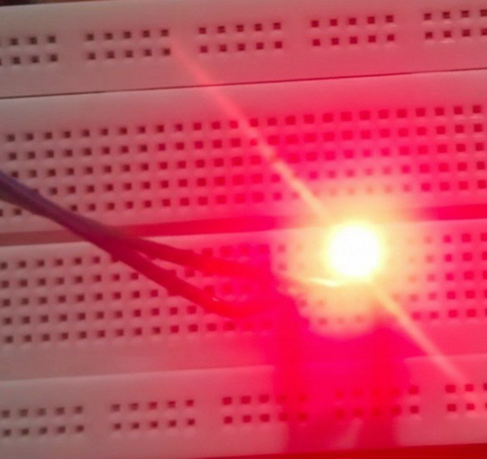
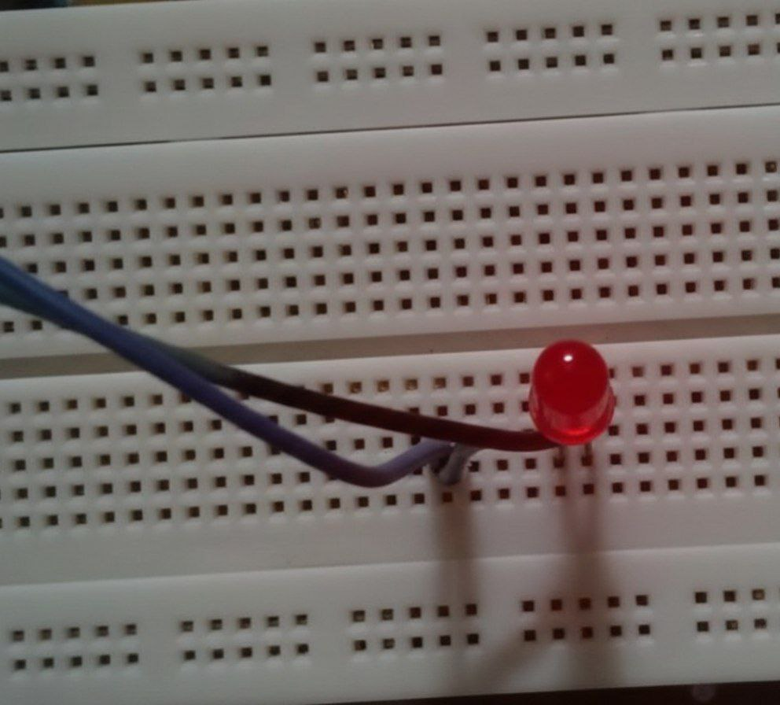

# 🔆 ESP32 LED Web Control (Documentation)

This project demonstrates how an **ESP32** can host a **mobile-friendly web portal**
to control an external LED using WiFi (Access Point mode).

No internet connection is required.

---

## 📱 Features
- ESP32 creates its **own WiFi network**
- Mobile-friendly responsive web page
- Toggle switch to turn LED ON/OFF
- DJ Mode for fast blinking LED
- STOP button to turn OFF LED and stop blinking

---

## 🔌 Hardware Used
- ESP32 Development Board
- External LED
- 220Ω Resistor
- Breadboard & Jumper wires

---

## 🔗 LED Connection

---

## 🛠️ Working Principle
1. ESP32 starts in **Access Point (AP) mode**
2. Hosts a web server on port 80
3. When a button is clicked:
   - `/toggle` → LED ON/OFF
   - `/dj` → Fast blinking (DJ Mode)
   - `/stop` → LED OFF
4. Web UI sends commands via HTTP requests
5. ESP32 processes the request and controls the LED

---

## 🖥️ Web Interface Output
The web page contains:

- A toggle switch  on for LED power
  
- DJ MODE button (rapid blink)

- WHEN IT STOPS

